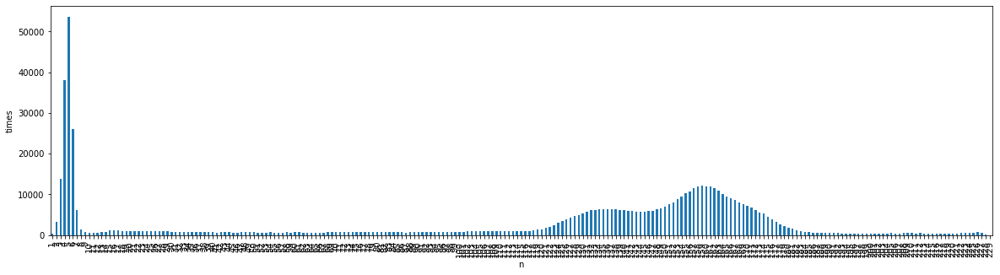

# Digital Images Processing

### Processing PGM Images at the bit level with Python

```python
import matplotlib.image as mpimg
import matplotlib.pyplot as pl
import pandas as pd
import sys
sys.path.append("./src")
from pgm_io import PGMio
```

```python
#################            Reading file

pgm = PGMio("./data/mdb155.pgm")

print("success" if pgm.cols * pgm.rows == len(pgm.data) else "fail")

pgm.header
```

    readed
    success


    {'type': 'P5', 'cols_rows': '1024 1024', 'maxValue': '255'}

```python
print(pgm)
```

                        input_file: str
                        header: { type, matrixsize, maxValue }
                        data: [int]
                        matrixForm :[[int]]
                        cols: int
                        rows: int
                        output_file: str
                        writeFile(output_file:str)


```python
#######################      Histogram
df = pd.DataFrame(pgm.data)

df = df.rename(columns={0:"n"})

df.groupby(['n'])['n'].count()
```

    n
    0      394010
    1         410
    2        3246
    3       13832
    4       38159
            ...
    225       601
    226       680
    227       481
    228       185
    229        24
    Name: n, Length: 230, dtype: int64

```python
df2 = df.loc[df['n'] > 0] #without values of 0

f = pl.figure(figsize=(20,5)) #size of the figure, 20x + y5

ax = f.gca()

df2.groupby(['n'])['n'].count().plot(kind="bar", x="n").set_ylabel("times") # Histogram
```

    Text(0, 0.5, 'times')



```python
############   average

withoutZero = [e for e in pgm.data if e is not 0]

avg = sum(withoutZero)/len(withoutZero)

maxValue = max(withoutZero)

minValue = min(withoutZero)

z = (maxValue - minValue)/avg
z
```

    2.068064794658987

```python
############# processing data

#o = map(lambda x: 255 if x>z else 0,data) # z value doesn't say nothing

z = 190 #setting manually because the formula is wrong and it must change

o = map(lambda x: 0 if x>z else x, pgm.data) # applying transform

output = list(o)

```

```python
############# writing a file

pgm.data = output

pgm.writeFile("./data/mamaOutput.pgm")
```

    ./data/mamaOutput.pgm was written

```python
#############     input and output
%matplotlib inline

images_name = ["./data/input.png","./data/output.png"]
images = [mpimg.imread(name) for name in images_name]

pl.figure(figsize=(20,30)) # size of the figure

columns = 2
for i, image in enumerate(images):
    pl.subplot(len(images) / columns + 1, columns, i + 1)
    pl.title(images_name[i])
    pl.imshow(image)
```


```python

```
